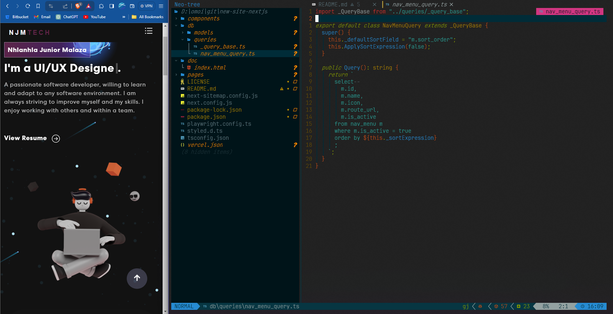

# NJMTECH Portfolio

[https://njmtech.co.za/](https://njmtech.co.za/) · [Vercel preview](https://njmtech.vercel.app/)

A modern portfolio built with **Next.js 16**, **React 19**, **Tailwind CSS**, and **shadcn/ui**.

## Tech stack

- **Framework**: Next.js 16 (App Router)
- **Runtime**: Node.js 24.x
- **Package manager**: pnpm
- **Styling**: Tailwind CSS 3, shadcn/ui, Framer Motion
- **i18n**: next-intl (`en`, `zu`)
- **Database**: Cloudflare D1 (optional)
- **Secrets**: Infisical (`pnpm dev`) or `.env.local` (`pnpm dev:local`)
- **Testing**: Playwright E2E
- **Deployment**: Vercel

## Getting started

### Prerequisites

- Node.js 24.x
- pnpm 9.x

### Installation

```bash
git clone https://github.com/omoinjm/njmtech-portfolio.git
cd njmtech-portfolio
pnpm install
cp .env.example .env.local
# Edit .env.local with your values
pnpm dev:local
```

Open [http://localhost:3000](http://localhost:3000).

For Infisical-backed development:

```bash
pnpm init   # link Infisical workspace once
pnpm dev
```

### Scripts

| Command | Purpose |
|---------|---------|
| `pnpm dev` | Dev server with Infisical secrets |
| `pnpm dev:local` | Dev server with `.env.local` |
| `pnpm build` | Production build |
| `pnpm start:local` | Run production build locally |
| `pnpm lint` | ESLint |
| `pnpm test` | Playwright E2E |
| `pnpm ai_cache` | Generate TTS voice cache |

## Project structure

```
src/
├── app/[locale]/     # Pages (home, projects, contact, qr)
├── app/api/          # Route handlers
├── components/       # UI, layout, home, contact, projects
├── lib/              # Config, D1 client, AI config
├── services/         # Data, SQL, AI orchestrator, TTS
├── i18n/             # Locale routing
└── tests/            # Playwright specs
public/               # Static assets, llms.txt, robots.txt
docs/                 # Config, SEO, SQL guides
```

See **`AGENTS.md`** for agent/ contributor conventions.

## Environment variables

Copy `.env.example` to `.env.local`. Server-only secrets (email, D1, API keys) must **not** use the `NEXT_PUBLIC_` prefix. See `docs/CONFIG_QUICK_REF.md`.

## Docker

Local development with hot reload:

```bash
cp .env.example .env.local
docker compose up --build
```

Production image:

```bash
docker build --target production -t njmtech-portfolio .
docker run -p 3000:3000 --env-file .env.local njmtech-portfolio
```

## Testing

```bash
pnpm dev:local          # terminal 1
pnpm test               # terminal 2
pnpm exec playwright show-report
```

## Contributing

See [CONTRIBUTING.md](./CONTRIBUTING.md). Agent conventions: [AGENTS.md](./AGENTS.md).

Please respect the license terms:

- Link back to [njmtech.co.za](https://njmtech.co.za/)
- Do not reuse the 3D voxel dog asset

## License

MIT — see [LICENSE](./LICENSE).

## Tutorial

[](https://www.youtube.com/watch?v=hYv6BM2fWd8)
