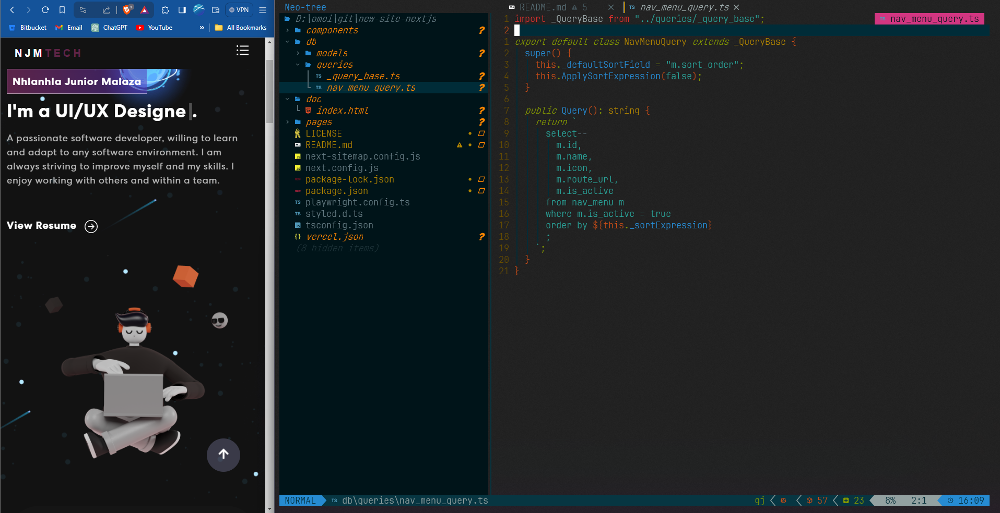

# NJMTECH Portfolio

[https://njmtech.co.za/](https://njmtech.co.za/) · [Vercel preview](https://njmtech.vercel.app/)

A modern portfolio built with **Next.js 16**, **React 19**, **Tailwind CSS**, and **shadcn/ui**.

## Tech stack

- **Framework**: Next.js 16 (App Router)
- **Runtime**: Node.js 24.x
- **Package manager**: pnpm
- **Styling**: Tailwind CSS 3, shadcn/ui, Framer Motion
- **i18n**: next-intl (`en`, `zu`)
- **Database**: Cloudflare D1 (optional)
- **Secrets**: Infisical (`pnpm dev`, scripts) · Vercel env in production
- **Testing**: Playwright E2E
- **Deployment**: Vercel

## Getting started

### Prerequisites

- Node.js 24.x
- pnpm 9.x
- Access to the Infisical workspace (secrets are not stored in `.env` files)

### Installation

```bash
git clone https://github.com/omoinjm/njmtech-portfolio.git
cd njmtech-portfolio
pnpm install
pnpm init   # link Infisical project (once per machine)
pnpm dev
```

Open [http://localhost:3000](http://localhost:3000).

### Scripts

| Command | Purpose |
|---------|---------|
| `pnpm init` | Link Infisical workspace |
| `pnpm dev` | Dev server (Infisical `dev` env) |
| `pnpm build` | Production build |
| `pnpm start:local` | Run production build locally |
| `pnpm lint` | ESLint |
| `pnpm test` | Playwright E2E |
| `pnpm ai_cache` | Generate Omoi TTS voice cache |
| `pnpm blog:upload` | Upload blog Markdown to R2 |

## Environment variables

Secrets live in **Infisical**, not in the repo. `.env.example` is a **catalog** (names + priority) — do not copy it locally.

| Priority | What | Examples |
|----------|------|----------|
| **P0** | Required | `EMAIL_*`, `NEXT_PUBLIC_SITE_URL` |
| **P1** | Production features | `D1_*`, `GITHUB_TOKEN`, `HF_TOKEN`, `BLOG_*` |
| **P2** | Optional (defaults exist) | `NEXT_PUBLIC_RESUME_URL`, Mailchimp |
| **P3** | Scripts/tests only | `R2_BUCKET_NAME`, `VOICE_CACHE_S3_BASE_URL` |

Full list: [`docs/CONFIG_QUICK_REF.md`](docs/CONFIG_QUICK_REF.md)

## Project structure

```
src/
├── app/[locale]/     # Pages (home, projects, contact, qr, blog)
├── app/api/          # Route handlers
├── components/       # UI, layout, home, contact, projects
├── lib/              # Config, D1 client, AI config, blog storage
├── services/         # Data, SQL, AI orchestrator, TTS
├── i18n/             # Locale routing
└── tests/            # Playwright specs
public/               # Static assets, llms.txt, robots.txt
docs/                 # Config, SEO, SQL guides
```

See **`AGENTS.md`** for agent/contributor conventions.

## Docker

Requires Infisical auth in the container (`INFISICAL_TOKEN` or `infisical login`):

```bash
export INFISICAL_TOKEN=...   # or run infisical login on the host
docker compose up --build
```

Production image (env injected at runtime — Vercel or `docker run -e ...`):

```bash
docker build --target production -t njmtech-portfolio .
docker run -p 3000:3000 -e EMAIL_MAIL=... -e EMAIL_USER=... -e EMAIL_APP_PASS=... njmtech-portfolio
```

## Testing

```bash
pnpm dev          # terminal 1 (Infisical)
pnpm test         # terminal 2
pnpm exec playwright show-report
```

## Contributing

See [CONTRIBUTING.md](./CONTRIBUTING.md). Agent conventions: [AGENTS.md](./AGENTS.md).

Please respect the license terms:

- Link back to [njmtech.co.za](https://njmtech.co.za/)
- Do not reuse the 3D voxel dog asset

## License

MIT — see [LICENSE](./LICENSE).

## Tutorial

[](https://www.youtube.com/watch?v=hYv6BM2fWd8)
