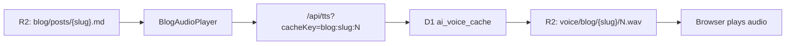

# Blog voice cache plan

How to generate, upload, and register pre-generated narration audio for blog posts.

**First post:** [Building with Cloudflare D1](https://njmtech.co.za/blog/cloudflare-d1-notes)  
**Slug:** `cloudflare-d1-notes`  
**Audio files needed:** **4** (one per TTS chunk)

---

## Overview

Blog narration uses the same pattern as Omoi assistant pills:

1. **Markdown** lives on R2 (content the player reads from).
2. **Audio bytes** live on R2 under `voice/blog/{slug}/`.
3. **Lookup rows** live in D1 `ai_voice_cache` (`cache_key` → `audio_url`).
4. At playback, `BlogAudioPlayer` calls `/api/tts` with `cacheKey=blog:{slug}:{chunkIndex}`.



---

## Voice profile

Blog posts use the **`blog`** TTS profile (calm narrator — not Omoi’s anxious voice).

| Infisical key | Purpose | Default |
|---------------|---------|---------|
| `BLOG_EDGE_TTS_VOICE` | Edge TTS voice name | `en-US-GuyNeural` |
| `BLOG_VOXCPM_REF_AUDIO` | Optional clone reference URL | — |
| `BLOG_VOXCPM_VOICE_INSTRUCTION` | Voice description if no ref audio | Clear, calm male narrator |

Set these in Infisical `dev` + `prod`. Production `/api/tts` tries **Edge TTS first**, then VoxCPM.

---

## Post: Building with Cloudflare D1

| Field | Value |
|-------|-------|
| Title | Building with Cloudflare D1 |
| Slug | `cloudflare-d1-notes` |
| Source markdown | `scripts/blog-seed/cloudflare-d1-notes.md` |
| R2 markdown URL | `https://s3.njmtech.co.za/njmtech-portfolio/blog/posts/cloudflare-d1-notes.md` |
| Chunking | `chunkSpeechText(markdownToSpeechText(content), 400)` |
| Title narrated? | **No** — only `post.content` |

Code blocks and markdown formatting are stripped before TTS. The TypeScript snippet in the article is **not** read aloud.

---

## Section 1 — Chunk 0

| | |
|---|---|
| **Cache key** | `blog:cloudflare-d1-notes:0` |
| **R2 object key** | `njmtech-portfolio/voice/blog/cloudflare-d1-notes/0.wav` |
| **Public URL** | `https://s3.njmtech.co.za/njmtech-portfolio/voice/blog/cloudflare-d1-notes/0.wav` |
| **Length** | 268 characters |

**Exact text to synthesize:**

```text
This site runs on Next.js 16 with optional Cloudflare D1 for structured data: projects, skills, navigation, and TTS voice cache. Blog posts like this one are stored as Markdown on Cloudflare R2 and fetched at build/runtime — not in the repo.

Why D1 for portfolio data
```

---

## Section 2 — Chunk 1

| | |
|---|---|
| **Cache key** | `blog:cloudflare-d1-notes:1` |
| **R2 object key** | `njmtech-portfolio/voice/blog/cloudflare-d1-notes/1.wav` |
| **Public URL** | `https://s3.njmtech.co.za/njmtech-portfolio/voice/blog/cloudflare-d1-notes/1.wav` |
| **Length** | 354 characters |

**Exact text to synthesize:**

```text
D1 fits small, relational content that changes occasionally but shouldn't require a redeploy:
Project cards grouped by category
Nav menu and footer links
Newsletter subscribers
Pre-generated AI voice cache URLs

When D1 is not configured, the app degrades gracefully: empty lists, skipped cache lookups, and static pages still work.

REST from the server
```

---

## Section 3 — Chunk 2

| | |
|---|---|
| **Cache key** | `blog:cloudflare-d1-notes:2` |
| **R2 object key** | `njmtech-portfolio/voice/blog/cloudflare-d1-notes/2.wav` |
| **Public URL** | `https://s3.njmtech.co.za/njmtech-portfolio/voice/blog/cloudflare-d1-notes/2.wav` |
| **Length** | 198 characters |

**Exact text to synthesize:**

```text
The portfolio talks to D1 through Cloudflare's HTTP API (src/lib/d1-client.ts), not a Worker binding. That keeps the Next.js app deployable on Vercel while secrets stay server-only via config.get().
```

---

## Section 4 — Chunk 3

| | |
|---|---|
| **Cache key** | `blog:cloudflare-d1-notes:3` |
| **R2 object key** | `njmtech-portfolio/voice/blog/cloudflare-d1-notes/3.wav` |
| **Public URL** | `https://s3.njmtech.co.za/njmtech-portfolio/voice/blog/cloudflare-d1-notes/3.wav` |
| **Length** | 381 characters |

**Exact text to synthesize:**

```text
What I'm busy with next
Blog section — file-based posts with a separate TTS voice for reading aloud
More Edge-native patterns — caching, ISR, and tighter Cloudflare integration
AI assistant polish — better fallback knowledge and voice cache coverage

If you're exploring D1 for your own site, start with one table and a single API route. Expand when the SQL workflow feels natural.
```

---

## Where to store each asset

### Layer A — Blog markdown (already uploaded)

| Asset | R2 bucket | Object key |
|-------|-----------|------------|
| Post body | `njmtech-blob` | `njmtech-portfolio/blog/posts/cloudflare-d1-notes.md` |
| Post index | `njmtech-blob` | `njmtech-portfolio/blog/index.json` |

**How to upload / refresh:**

```bash
# Edit scripts/blog-seed/cloudflare-d1-notes.md, then:
pnpm blog:upload
```

Requires: Infisical linked (`pnpm init`), `wrangler login`, Infisical keys `R2_BUCKET_NAME=njmtech-blob`, `BLOG_STORAGE_PREFIX=njmtech-portfolio/blog`.

---

### Layer B — Audio files (4 WAV/MP3 files)

| File | R2 bucket | Object key |
|------|-----------|------------|
| Chunk 0 audio | `njmtech-blob` | `njmtech-portfolio/voice/blog/cloudflare-d1-notes/0.wav` |
| Chunk 1 audio | `njmtech-blob` | `njmtech-portfolio/voice/blog/cloudflare-d1-notes/1.wav` |
| Chunk 2 audio | `njmtech-blob` | `njmtech-portfolio/voice/blog/cloudflare-d1-notes/2.wav` |
| Chunk 3 audio | `njmtech-blob` | `njmtech-portfolio/voice/blog/cloudflare-d1-notes/3.wav` |

**How to generate audio:**

Manual (until `pnpm blog-voice:generate` exists):

1. Synthesize each chunk’s **exact text** above using Edge TTS or VoxCPM with the **blog** profile.
2. Save as `0.wav` … `3.wav` locally.

**How to upload each file to R2:**

```bash
# One file (repeat for 0, 1, 2, 3)
npx wrangler r2 object put njmtech-blob/njmtech-portfolio/voice/blog/cloudflare-d1-notes/0.wav \
  --file=./0.wav \
  --content-type=audio/wav \
  --remote
```

Or batch with a small loop:

```bash
for i in 0 1 2 3; do
  npx wrangler r2 object put "njmtech-blob/njmtech-portfolio/voice/blog/cloudflare-d1-notes/${i}.wav" \
    --file="./${i}.wav" \
    --content-type=audio/wav \
    --remote
done
```

**Verify public access:**

```bash
curl -sI "https://s3.njmtech.co.za/njmtech-portfolio/voice/blog/cloudflare-d1-notes/0.wav"
# Expect: HTTP/2 200
```

Public base URL (code default): `https://s3.njmtech.co.za/njmtech-portfolio/voice/blog` — see `src/lib/blog-voice-cache.ts`.

---

### Layer C — D1 lookup rows (4 rows)

Database: **`njmtech-projects`** (`773865eb-1e3b-4ee3-9592-ffe658765d19`)  
Table: **`ai_voice_cache`**

Each row maps a stable `cache_key` to the public R2 URL. D1 stores **URLs only**, not audio bytes.

| cache_key | audio_url | provider |
|-----------|-----------|----------|
| `blog:cloudflare-d1-notes:0` | `https://s3.njmtech.co.za/njmtech-portfolio/voice/blog/cloudflare-d1-notes/0.wav` | `EdgeTTS` or `VoxCPM` |
| `blog:cloudflare-d1-notes:1` | `https://s3.njmtech.co.za/njmtech-portfolio/voice/blog/cloudflare-d1-notes/1.wav` | `EdgeTTS` or `VoxCPM` |
| `blog:cloudflare-d1-notes:2` | `https://s3.njmtech.co.za/njmtech-portfolio/voice/blog/cloudflare-d1-notes/2.wav` | `EdgeTTS` or `VoxCPM` |
| `blog:cloudflare-d1-notes:3` | `https://s3.njmtech.co.za/njmtech-portfolio/voice/blog/cloudflare-d1-notes/3.wav` | `EdgeTTS` or `VoxCPM` |

**Example SQL** (run in Cloudflare D1 console or via wrangler):

```sql
DELETE FROM ai_voice_cache WHERE cache_key LIKE 'blog:cloudflare-d1-notes:%';

INSERT INTO ai_voice_cache (cache_key, response_text_hash, response_text, audio_url, provider)
VALUES (
  'blog:cloudflare-d1-notes:0',
  '<sha256-of-chunk-0-text>',
  'This site runs on Next.js 16 with optional Cloudflare D1...',
  'https://s3.njmtech.co.za/njmtech-portfolio/voice/blog/cloudflare-d1-notes/0.wav',
  'EdgeTTS'
);
```

Repeat for `:1`, `:2`, `:3`. Use `DELETE` + `INSERT` (not `ON CONFLICT`) — the unique index on `cache_key` is partial. Ready-made file: `scripts/seed-blog-voice-cloudflare-d1-notes.sql`.

**How to run SQL:**

```bash
# Save statements to scripts/seed-blog-voice-cloudflare-d1-notes.sql, then:
npx wrangler d1 execute njmtech-projects --remote --file=scripts/seed-blog-voice-cloudflare-d1-notes.sql
```

Requires Infisical / env: `D1_ACCOUNT_ID`, `D1_DATABASE_ID`, `D1_API_TOKEN` (P1 keys).

---

### Layer D — Local dev manifest (optional)

For dev without D1, add URLs to `src/lib/blog-voice-cache.ts`:

```typescript
export const BLOG_VOICE_CACHE_URLS: Record<string, string> = {
  "blog:cloudflare-d1-notes:0": "https://s3.njmtech.co.za/njmtech-portfolio/voice/blog/cloudflare-d1-notes/0.wav",
  "blog:cloudflare-d1-notes:1": "https://s3.njmtech.co.za/njmtech-portfolio/voice/blog/cloudflare-d1-notes/1.wav",
  "blog:cloudflare-d1-notes:2": "https://s3.njmtech.co.za/njmtech-portfolio/voice/blog/cloudflare-d1-notes/2.wav",
  "blog:cloudflare-d1-notes:3": "https://s3.njmtech.co.za/njmtech-portfolio/voice/blog/cloudflare-d1-notes/3.wav",
};
```

Production should rely on **D1**, not this manifest.

---

## End-to-end checklist

- [ ] **Markdown on R2** — `pnpm blog:upload`
- [ ] **Generate 4 audio files** from exact chunk text (sections 1–4 above)
- [ ] **Upload 4 files to R2** — `njmtech-portfolio/voice/blog/cloudflare-d1-notes/{0-3}.wav`
- [ ] **Insert 4 D1 rows** — `cache_key` = `blog:cloudflare-d1-notes:{0-3}`
- [ ] **Verify** — open blog post, click Listen, confirm all 4 chunks play from cache
- [ ] **Optional** — populate `BLOG_VOICE_CACHE_URLS` for local dev without D1

---

## Verification commands

```bash
# R2 markdown
curl -s "https://s3.njmtech.co.za/njmtech-portfolio/blog/index.json"

# R2 audio
curl -sI "https://s3.njmtech.co.za/njmtech-portfolio/voice/blog/cloudflare-d1-notes/0.wav"

# D1 lookup (via Infisical)
pnpm voice-cache:test:d1
# Or query: SELECT cache_key, audio_url FROM ai_voice_cache WHERE cache_key LIKE 'blog:cloudflare-d1-notes:%';

# Live TTS API (production)
curl -s "https://njmtech.co.za/api/tts" \
  -H "Content-Type: application/json" \
  -d '{"cacheKey":"blog:cloudflare-d1-notes:0","text":"..."}'
```

---

## Adding voice for a new post

1. Add `scripts/blog-seed/{slug}.md` and run `pnpm blog:upload`.
2. Compute chunks (same utils as the player):

   ```bash
   npx tsx -e "
   import { chunkSpeechText, markdownToSpeechText } from './src/utils/markdown-to-speech.ts';
   // ... load post content, log chunks.length and text
   "
   ```

3. Generate **N = chunks.length** audio files (not 1 full-article file).
4. Upload to `njmtech-portfolio/voice/blog/{slug}/{0..N-1}.wav`.
5. Insert D1 rows with keys `blog:{slug}:{0..N-1}`.
6. Optionally add entries to `BLOG_VOICE_CACHE_URLS`.

**Planned automation:** `pnpm blog-voice:generate --slug cloudflare-d1-notes` will handle steps 2–5.

---

## Related files

| File | Role |
|------|------|
| `src/components/blog/BlogAudioPlayer.tsx` | Chunks content, requests `blog:{slug}:{index}` |
| `src/lib/blog-voice-cache.ts` | Cache key helpers + dev manifest |
| `src/lib/tts-profiles.ts` | Blog vs assistant voice settings |
| `src/services/voice-cache.service.ts` | D1 → manifest resolution |
| `src/utils/markdown-to-speech.ts` | Strip MD + chunk at 400 chars |
| `scripts/upload-blog-to-r2.ts` | Upload markdown to R2 |
| `scripts/generate-voice-cache.ts` | Omoi voice reference (blog script TBD) |

## See also

- [`CONFIG_QUICK_REF.md`](./CONFIG_QUICK_REF.md) — Infisical env priorities
- [`AGENTS.md`](../AGENTS.md) — project conventions
